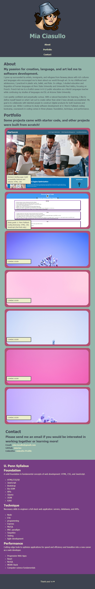
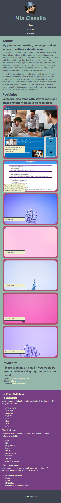

# Mia Ciasullo's Coding Portfolio

## Description
This built-from-scratch project is all about getting myself out there as a developer, showing my recent works, and connecting with other professionals in the field. In this page is an About Me, Portfolio, and Contact section as well as some extra information about the formative education that has led me here. The primary goal is to use this site as a tool to engage in conversations with peers and to seek employment based.

I learned the value of styling via CSS and the wonders that accompany its more advanced features such as:
* flexbox - allows for responsive design to adapt to various screen sizes
* key frames - enables animation!
* pseudo-classes - activates basic interactivity with the site's elements
* media queries - dictates the design element changes for specific screens

## Assets
The following image demonstrates the web application's appearance at 992px or smaller for tablets:

The following image demonstrates the web application's appearance at 768px or smaller for large mobile phones:

The following image demonstrates the web application's appearance at 576px or smaller for small mobile phones:

## Installation
N/A. [Deployed site here!](https://miacias.github.io/coding-portfolio/)

## Usage
This page showcases me, Mia Ciasullo, focusing on my work as a developer while also giving a window into my life as a person. The page displays my work, languages and frameworks learned, and contact information.

## Roadmap
Content will be added and adjusted as new coding projects are available! Some projects may phase out over time as my work becomes more specialized.

## Credits
Documentation referenced:
* Mozilla Developer Network (HTML and CSS)
* Slack Overflow forums
* U. Penn Bootcamp study groups

Artists:
* Marek Piwnicki, Poland, Unsplash.com - beautiful free-to-use nature placeholder images for future projects
* MistyAamen, ColourLovers.com - color palette for all backgrounds and font colors

## License
Please refer to the LICENSE in the repo.
